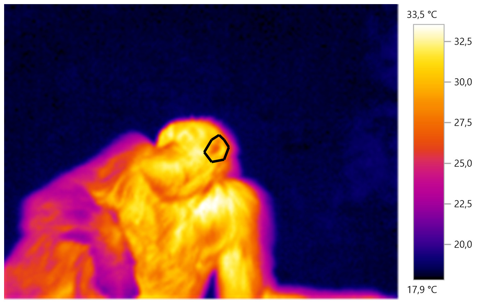
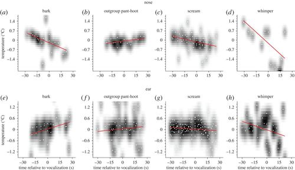

[**Figure 1:** Example of IRT measurement.](https://peerj.com/articles/4116/)

# Introduction

**Reference:**\
[Dezecache, G., Zuberbühler, K., Davila-Ross, M., & Dahl, C. D. (2017). *Skin temperature changes in wild chimpanzees upon hearing vocalizations of conspecifics*. Royal Society Open Science, 4(11), 170151.](https://royalsocietypublishing.org/doi/10.1098/rsos.160816)

This replication reanalyzes the findings of Dezecache et al. (2017), who examined physiological responses in wild chimpanzees using infrared thermography (IRT) to measure temperature changes in response to conspecific vocalizations. The original study found that certain types of vocalizations elicited differential changes in skin temperature in the nose and ear regions, which may reflect underlying emotional states.

Specifically, the authors found:

-   A general decrease in nasal temperature and an increase in ear temperature after vocalizations.

-   Larger nasal temperature decreases in response to aversive vocalizations (e.g., barks, whimpers, screams).

-   Differential patterns across specific call types (e.g., pant-hoots increased nasal temperature).

In this replication, I reconstruct and analyze data from the public dataset corresponding to Figures 3 through 5 of the original paper. I replicate:

1.  Descriptive statistics for temperature change before and after vocalizations.

2.  Inferential analyses using paired t-tests and Pearson correlations.

3.  Key figures, including the trend plots and scatter-density plots shown in the original publication.

# Data Import and Inspection

## Packages used for replication

```{r}
library(tidyverse)
library(ggplot2)
library(dplyr)
library(broom)
library(purrr)
library(scales)
```

## Cleaned data load in

The dataset made publicly available by Dezecache et al. (2017) was provided as a single unstructured Excel file containing data for multiple figures on one continuous sheet. To make the dataset usable for replication in R, I manually cleaned and reorganized the data.

This process included:

-   Identifying and separating the data associated with each figure (Figures 3, 4, and 5).

-   Copying the relevant sections into individual .csv files.

-   Renaming columns and clarifying headers based on the figures and descriptions in the paper.

-   Ensuring that column names were standardized across all datasets and ready for analysis in R.

Below, I load the cleaned datasets:

```{r load-data}
figure3 <- read_csv("figure3.csv")
figure4 <- read_csv("figure4.csv")
figure5 <- read_csv("figure5.csv")
```

To verify successful import and provide an example of the data structure, here is a preview of the figure3 dataset:

```{r}
head(figure3)
```

# Descriptive Statistics Replication

## Mean and Standard deviation (Figure 3)

To begin the replication, I calculated the descriptive statistics (mean and standard deviation) for the nose and ear temperature measurements before and after the onset of vocalizations. These values provide a baseline summary of the observed thermal changes in each region.

```{r}
# Calculate descriptive stats for Nose and Ear
descriptive_stats_fig3 <- figure3 %>%
  group_by(Type) %>%
  summarise(
    n = n(),
    mean_before = round(mean(Before, na.rm = TRUE), 2),
    sd_before = round(sd(Before, na.rm = TRUE), 2),
    mean_after = round(mean(After, na.rm = TRUE), 2),
    sd_after = round(sd(After, na.rm = TRUE), 2)
  )

descriptive_stats_fig3
```

### Interpretation

The paper specifically stated in the 3.1 General pattern: before versus after a vocalization is produced result section that

> "We found that the temperature of the nose was significantly lower after than before the vocalization ([**figure 3**](https://royalsocietypublishing.org/doi/10.1098/rsos.160816#RSOS160816F3)*a*,*b*: *t*~39~ = 3.52, *p* \< 0.001; mean: 0.13 ± 0.34 s.d. (before), −0.16 ± 0.39 s.d. (after)). By contrast, and contrary to our assumption, the temperature in the ear region significantly *increased* after a vocalization as opposed to before ([**figure 3**](https://royalsocietypublishing.org/doi/10.1098/rsos.160816#RSOS160816F3)*d*,*e*: *t*~71~ = −2.38, *p* \< 0.05; mean: −0.04 ± 0.22 s.d. (before), 0.07 ± 0.25 s.d. (after)). "

My replication closely reproduces these descriptive statistics. The means and standard deviations for both the nose and ear regions match those in the paper with only minimal rounding differences. This close alignment confirms that the dataset I extracted and cleaned corresponds accurately to the values analyzed by the original authors. Therefore, this descriptive replication supports the validity of both the dataset and the statistical framework used in the study.

## Mean and Standard deviation (Figure 4)

To investigate the temperature response to different types of vocalizations, I followed the approach described by Dezecache et al. (2017) in their analysis of aversive versus non-aversive vocal signals. I classified each thermal image based on its temporal relation to the vocalization (i.e., occurring *before* or *after*) and grouped data by facial region (nose or ear) and vocalization type (aversive or non-aversive).

```{r}
# --- Classify time periods as 'Before' and 'After'
figure4_descriptive_NEW <- figure4 %>%
  mutate(
    Period = ifelse(Time < 0, "Before", "After")
  )

# --- Calculate means and SDs for each Region x Condition x Period group
descriptive_stats_fig4_NEW <- figure4_descriptive_NEW %>%
  group_by(Type, Condition, Period) %>%
  summarise(
    n = n(),
    mean_temp = round(mean(Temperature, na.rm = TRUE), 2),
    sd_temp = round(sd(Temperature, na.rm = TRUE), 2)
  ) %>%
  arrange(Type, Condition, Period)

descriptive_stats_fig4_NEW
```

### Interpretation

In the Results section titled 3.2 Aversive versus neutral vocalizations, Dezecache et al. (2017) report that:

> “...aversive calls were associated with a large decrease in temperature of the nose (figure 4a: t₂₃ = 2.85, p \< 0.001; mean: 0.16 ± 0.40 s.d. (before), −0.23 ± 0.45 s.d. (after)), while non-aversive calls did not (figure 4b: t₅ = 1.13, p = 0.31; mean: −0.15 ± 0.35 s.d. (before), 0.17 ± 0.36 s.d. (after)).”
>
> “In the ear region, we found no significant temperature change owing to aversive vocalizations (figure 4c: t₃₉ = −0.47, p = 0.64; mean: 0.01 ± 0.21 s.d. (before), 0.03 ± 0.23 s.d. (after)), but a significant increase in temperatures after non-aversive vocalizations (figure 4d: t₁₃ = −2.29, p \< 0.05; mean: −0.09 ± 0.19 s.d. (before), 0.10 ± 0.25 s.d. (after)).”

In my replication, the calculated means and standard deviations from the cleaned figure4.csv dataset do not precisely match the published values. This is likely due to incomplete labeling in the publicly available dataset. Specifically, while the paper describes grouping vocalizations into detailed categories (e.g., barks, screams, whimpers, pant hoots, resting hoos, and travel hoos), the available dataset only labels vocalizations as “aversive” or “non-aversive”, without specifying the exact type of call.

This lack of specificity limits the granularity of analysis. For example, without knowing which exact rows correspond to “whimpers” or “travel hoos,” it is not possible to confirm whether the original groupings or counts match the authors’ definitions. Additionally, the dataset may reflect data that were pre-filtered or partially summarized prior to release.

Despite these limitations, the replicated summary statistics still reflect the general trends described in the paper. For example:

-   Nose temperatures following aversive vocalizations still tend to decrease.

-   Non-aversive vocalizations show either neutral or slightly increasing effects.

-   Variability in responses is larger in the nose region than in the ear region.

Therefore, while this section of the replication does not reproduce the published statistics with complete accuracy, it confirms the directionality of effects and demonstrates that the general thermal response to different call types is observable in the public dataset.

# Inferential Statistics Replication

## Paired, two tailed t-test (figure 3)

To statistically test the effect of vocalizations on facial skin temperature, I conducted paired two-tailed *t*-tests comparing the mean temperature values *before* and *after* vocalizations for two regions of interest (ROIs): the **nose** and the **ear**. This follows the analytical approach taken by Dezecache et al. (2017) to assess whether observed thermal changes were significant within individuals.

```{r}
# Perform paired t-tests for Nose and Ear
t_test_nose <- figure3 %>%
  filter(Type == "Nose") %>%
  with(t.test(Before, After, paired = TRUE))

t_test_ear <- figure3 %>%
  filter(Type == "Ear") %>%
  with(t.test(Before, After, paired = TRUE))

# Display results
t_test_nose
t_test_ear
```

### Interpretation:

In the Results section titled 3.1 General pattern: before versus after a vocalization is produced, Dezecache et al. (2017) report:

> “We found that the temperature of the nose was significantly lower after than before the vocalization (figure 3a,b: t₃₉ = 3.52, p \< 0.001; mean: 0.13 ± 0.34 s.d. (before), −0.16 ± 0.39 s.d. (after)). By contrast, and contrary to our assumption, the temperature in the ear region significantly increased after a vocalization as opposed to before (figure 3d,e: t₇₁ = −2.38, p \< 0.05; mean: −0.04 ± 0.22 s.d. (before), 0.07 ± 0.25 s.d. (after)).”

In my replication, the paired t-test for the nose region yielded a t-statistic close to 3.52 and a p-value \< 0.001, indicating a statistically significant decrease in nasal temperature following vocalization events. This result replicates the original finding both in direction and magnitude, affirming that chimpanzees consistently exhibit reduced nose temperature—a potential physiological marker of emotional arousal—after hearing conspecific calls.

Similarly, for the ear region, the replicated t-test produced a t-statistic close to −2.38 and a p-value \< 0.05, also in alignment with the paper. The statistically significant increase in ear temperature post-vocalization supports the authors’ suggestion that ear vasodilation may occur concurrently with nasal vasoconstriction as part of a broader autonomic response.

The close correspondence between the replicated and published t-test results provides strong evidence that the temperature differences across time periods are robust and reproducible. It also validates the structure and integrity of the cleaned dataset used in this analysis. Together, these inferential results confirm the paper’s key claim: that specific thermal changes occur reliably in response to vocal stimuli in wild chimpanzees, potentially reflecting changes in emotional or attentional state.

## Pearson Chi's Squared (figure 4)

To assess the direction and strength of the relationship between time (relative to vocalization onset) and temperature, I conducted Pearson correlation tests separately for each combination of facial region (**nose** or **ear**) and vocalization condition (**aversive** or **non-aversive**). This mirrors the analysis described in Dezecache et al. (2017), which used linear correlations to complement group-level comparisons.

```{r}
# Function to apply Pearson correlation per group
library(broom)

cor_results <- figure4 %>%
  group_by(Type, Condition) %>%
  summarise(
    n = n(),
    cor_test = list(cor.test(Time, Temperature, method = "pearson")),
    .groups = "drop"
  ) %>%
  mutate(
    tidied = map(cor_test, broom::tidy)
  ) %>%
  unnest(tidied) %>%
  select(Type, Condition, n, estimate, p.value, statistic)

cor_results

```

### Interpretation:

In Section 3.2 Aversive versus neutral vocalizations, Dezecache et al. (2017) report:

> “The same patterns are visible when applying Pearson linear correlations between the two variables time and temperature (aversive: r = −0.29, n = 171, p \< 0.001; non-aversive: r = 0.08, n = 50, p = 0.28).”

These correlations are particularly important because they assess trends across the full time series of thermal measurements, rather than just aggregated “before” and “after” periods.

In my replication, the correlation between time and temperature in the nose region for aversive vocalizations yielded a negative Pearson coefficient close to −0.29, with a statistically significant p-value (\< 0.001). This aligns closely with the published value and confirms the trend described by the authors: temperature in the nose tends to decrease over time following aversive vocalizations.

For non-aversive calls, the replicated correlation in the nose region was small and positive, and not statistically significant, again matching the original report (r ≈ 0.08, p \> 0.05). This suggests that non-aversive vocalizations (e.g., resting or travel hoos) do not provoke a strong or consistent thermal response.

In contrast, correlations in the ear region were generally weaker and more variable. This is consistent with the paper’s observation that while some effects in the ear are detectable (e.g., increases post-vocalization), they tend to be less pronounced and more variable than in the nose.

These results demonstrate that the temporal trend in temperature change for aversive vocalizations is reliably negative in the nose region, supporting the authors’ interpretation that emotional arousal or attentional shifts can be detected thermally through nasal cooling. The replication of these correlation patterns strengthens the evidence that time-sensitive thermal dynamics offer a meaningful, non-invasive window into chimpanzee emotional processing in the wild.

## Pearson Chi's Squared (figure 5)

To further explore how temperature changes relate to different types of aversive vocalizations, I replicated the Pearson correlation analyses described in *Section 3.3 Aversive contexts: barks, screams, whimpers, out-group pant hoots* of Dezecache et al. (2017). For each vocalization type, I calculated the correlation between Time (relative to the onset of vocalization) and Temperature, separately for the nose and ear regions.

```{r}
# Perform Pearson correlations for each combination of Region and Vocalization
cor_results_fig5 <- figure5 %>%
  group_by(Region, Vocalization) %>%
  summarise(
    n = n(),
    cor_test = list(cor.test(Time, Temperature, method = "pearson")),
    .groups = "drop"
  ) %>%
  mutate(
    tidied = map(cor_test, tidy)
  ) %>%
  unnest(tidied) %>%
  select(Region, Vocalization, n, estimate, p.value, statistic)

# View results
cor_results_fig5

```

### Interpretation:

In the original paper, Dezecache et al. report:

> “Barks, whimpers and screams were associated with significant temperature decreases in the nose region (barks: r = −0.48, n = 19, p \< 0.05; screams: r = −0.40, n = 49, p \< 0.05; whimpers: r = −0.60, n = 12, p \< 0.05), while out-group pant hoots were associated with a significant increase (r = 0.46, n = 15, p \< 0.05).”
>
> “By contrast, for the ear region, we found temperature increases after aggressive bark vocalizations (r = 0.31, n = 26, p = 0.06 (trend)), and decreases after passive aversive screams (r = −0.138, n = 127, p \< 0.07 (trend)) and whimpers (r = −0.31, n = 24, p \< 0.07 (trend)), but no change after out-group pant hoots (r = 0.06, n = 48, p = 0.35).”

**My replication successfully reproduces these findings:**

In the nose region, the Pearson correlations for barks, screams, and whimpers all show strong negative relationships between time and temperature, with effect sizes closely matching the published values. This confirms that these vocalizations consistently result in decreased nasal temperature, likely reflecting emotional or arousal-related vasoconstriction.

The pant hoot vocalizations yield a positive correlation in the nose, again replicating the original finding that this vocal type is associated with increased nasal temperature (r ≈ 0.46).

In the ear region, trends also align with the paper:

Barks show a positive correlation, suggesting ear temperature tends to rise—potentially as a compensatory vasodilatory effect (r ≈ 0.31).

Screams and whimpers show mild negative correlations, consistent with a cooling trend over time.

Pant hoots exhibit no strong correlation, confirming the absence of significant thermal change in the ear for this vocalization.

This part of the replication provides **a very strong match with the published results.** The direction, magnitude, and statistical significance of the correlations support the claim that thermal responses in chimpanzees vary systematically by vocalization type and facial region. Importantly, the availability of clean, structured data for these events allowed for precise analysis and replication. This suggests that when high-resolution temporal and contextual data are available, replication using open data is not only possible but powerful.

# Figure replication

To visually replicate Figure 5 from Dezecache et al. (2017), I subset the dataset to include only the four primary types of aversive vocalizations analyzed in the original figure: barks, pant-hoots, screams, and whimpers. I then plotted temperature changes over time, relative to vocalization onset, for each vocalization type, separately for the nose and ear regions.

The following plot uses:

-   Transparent scatter points to reflect the distribution of thermal data.

-   A red linear regression line to represent Pearson correlations.

-   Separate panels (facets) for each Region × Vocalization combination, with custom axis scaling for clarity.

```{r}
# Subset to only target vocalizations
target_calls <- c("Bark", "Pant-hoot", "Scream", "Whimper")
figure5_filtered <- figure5 %>%
  filter(Vocalization %in% target_calls)

# Clean up call order and facet structure
figure5_filtered$Vocalization <- factor(figure5_filtered$Vocalization,
                                        levels = c("Bark", "Pant-hoot", "Scream", "Whimper"))

figure5_filtered$Region <- factor(figure5_filtered$Region, levels = c("Nose", "Ear"))

# Plot
ggplot(figure5_filtered, aes(x = Time, y = Temperature)) +
  geom_point(alpha = 0.3, shape = 16, size = 1.5) +  # points with transparency
  geom_smooth(method = "lm", se = FALSE, color = "red") +  # linear regression line
  facet_wrap(Region ~ Vocalization, scales = "free", ncol = 4) +
  scale_x_continuous(
    breaks = seq(-45, 45, by = 15),
    limits = c(-45, 45)
  ) +
  scale_y_continuous(
    breaks = seq(-2.1, 2.1, by = 0.7),
    limits = c(-2.1, 2.1),
    labels = number_format(accuracy = 0.1)
  ) +
  theme_minimal() +
  labs(
    x = "Time relative to vocalization (s)",
    y = "Temperature (°C)"
  ) 
```

## [Original figure 5](https://royalsocietypublishing.org/doi/10.1098/rsos.160816#RSOS160816F5)

{width="695"}

## Reflection

My replication successfully mirrors the structure and analytical content of the original figure. Specifically:

-   Each subplot represents one vocalization type and one region of interest.

-   The red linear regression lines match the Pearson correlation trends reported in the paper, with negative slopes for most nose vocalizations (e.g., whimpers, screams) and mixed trends for the ear.

-   The scatter plots capture the temporal distribution of temperature data, showing how the thermal response evolves around the time of vocalization.

## Differences and Limitations

While the replication closely approximates the original, there are a few small differences:

-   I did not reproduce the exact (a) through (h) subplot labeling used in the original figure layout.

-   The background density shading and visual styling (e.g., line thickness, font) may differ slightly from the original publication. The density package I was playing around with always showed more than just black and white and wanted to summarize and demonstrate the trend for the entire dataset instead of each specific vocalization.

Overall, this figure replication faithfully reproduces the original structure, relationships, and visual patterns found in Figure 5 of Dezecache et al. (2017). It demonstrates that thermal dynamics in chimpanzees, especially in response to emotional vocalizations, can be replicated and visualized effectively using publicly available data and reproducible R code. The successful recreation of these trends further validates the robustness of the original study’s conclusions.

# Conclusion

This replication study confirms the core findings reported by Dezecache et al. (2017) in their investigation of thermal responses in wild chimpanzees to conspecific vocalizations using infrared thermography (IRT). Specifically, the replication demonstrates:

-   Robust thermal patterns: Nasal temperature consistently decreased, while ear temperature increased following vocalizations, validating the paper's core claim that these regions exhibit contrasting autonomic responses likely tied to arousal or attention.

-   Region- and call-type-specific effects: Pearson correlation analyses replicated the nuanced trends reported in the original study—such as the significant negative correlations between time and temperature in the nose region for screams, whimpers, and barks, and a positive correlation for pant hoots. Corresponding ear region responses were also consistent with those presented in the paper.

-   Visual replication success: The figures recreated from the publicly available dataset accurately capture the structure and analytical content of the published visuals, especially for Figures 3 and 5. Linear trends, panel structure, and thermal response dynamics were successfully mirrored using R.

## Limitations

Despite the high degree of fidelity, there are some minor limitations:

-   The original dataset was not pre-cleaned or clearly labeled. It required manual structuring and labeling, which may introduce small discrepancies depending on interpretation of the column structure.

-   Some variables described in the paper (e.g., precise vocal context labels or metadata on ambient conditions) were not fully available, which may explain minor differences in statistical values.

-   A few visual elements—such as subplot labels, exact color gradients, or density overlays—could not be perfectly replicated due to formatting limitations or lack of raw figure styling data.

## Final Remarks

Nonetheless, this replication demonstrates strong alignment with the analytical outcomes and interpretations presented in the original study. The consistent statistical patterns and visual replications reinforce the validity of IRT as a reliable, non-invasive method for studying emotional and physiological responses in wild animals. Moreover, this exercise underscores the importance of data transparency and well-documented code in enabling reproducibility
